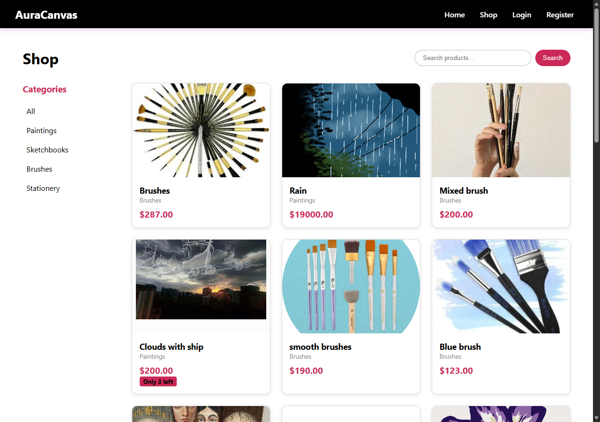
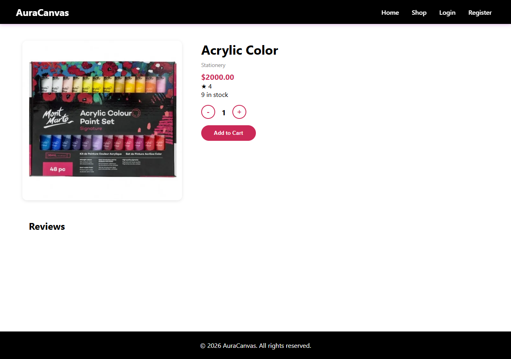
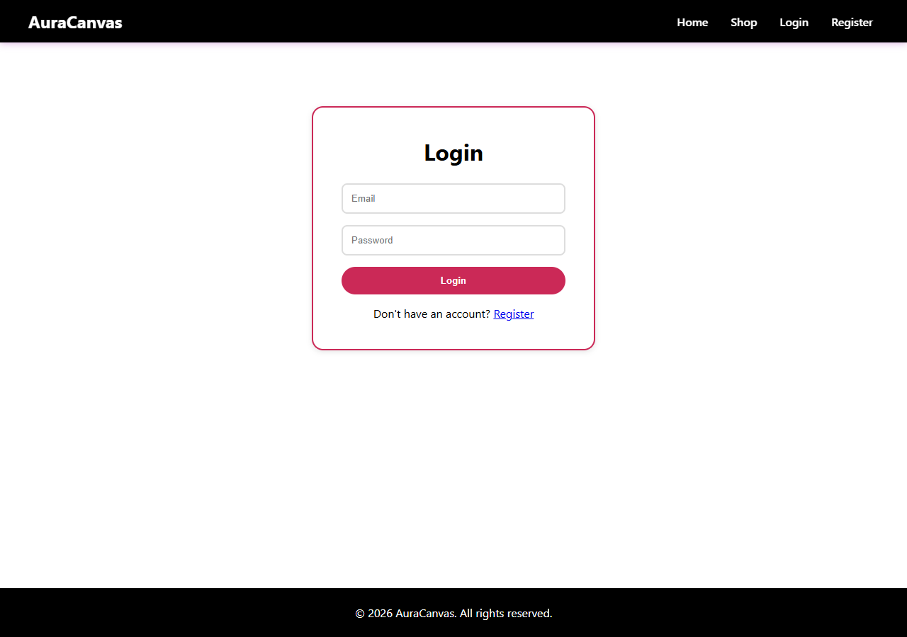
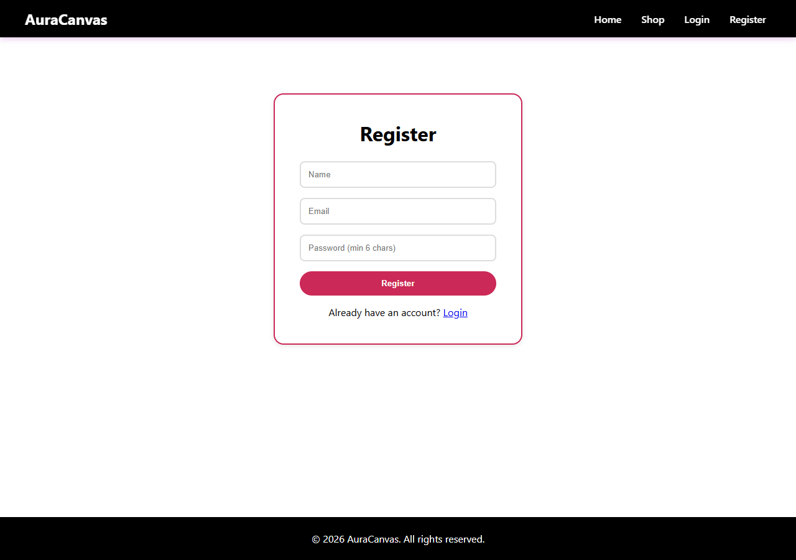
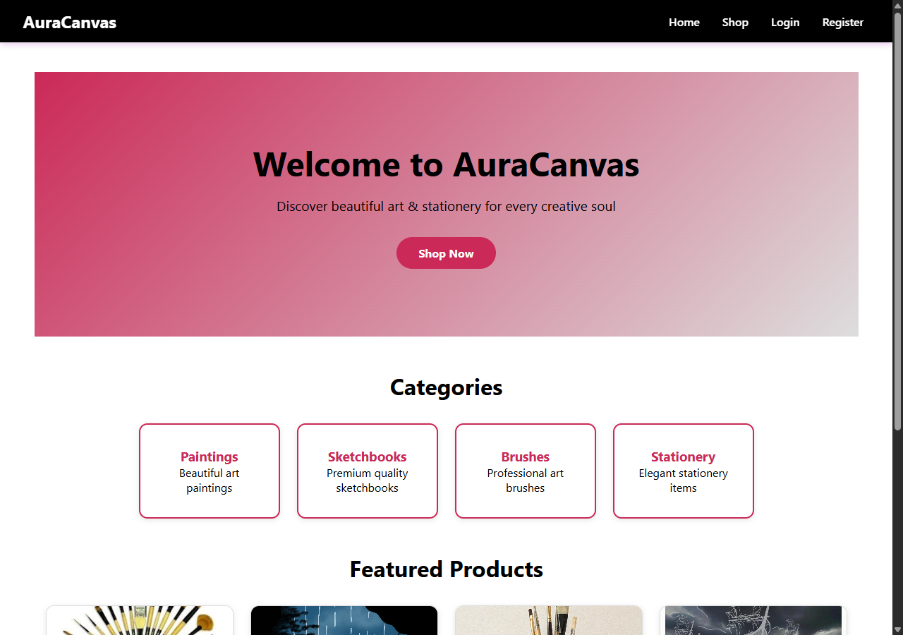
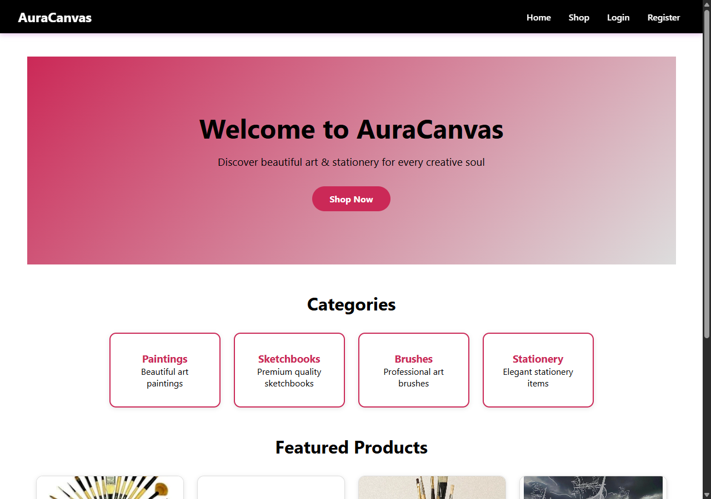

# AuraCanvas

A full-stack art & stationery e-commerce platform built with Spring Boot and React, featuring separate user and admin panels.

## Tech Stack

**Backend:** Java 25, Spring Boot 3.4.1, Spring Security, Spring Data JPA, PostgreSQL, JWT (0.12.6)

**Frontend:** React 18, React Router 6, Axios, react-icons (Feather)

## Screenshots

### User Pages

| Home | Shop | Product Detail |
|------|------|----------------|
|  |  |  |

| Login | Register | Cart |
|-------|----------|------|
|  |  |  |

### Admin Pages (login required)

| Dashboard | Products | Orders | Users |
|-----------|----------|--------|-------|
|  |  |  |  |

## Features

### User
- Browse products by category
- Product detail with reviews and star ratings
- Shopping cart with quantity controls
- Checkout and order history
- Write reviews (clickable star icons)

### Admin
- Dashboard with stats (products, orders, revenue, users)
- Product management (add, edit — no delete)
- Order management
- User management
- Image upload for products

### General
- JWT-based authentication
- Role-based access (USER / ADMIN)
- Responsive black/crimson/grey theme
- Vector icons throughout (no emoji)

## Getting Started

### Prerequisites
- JDK 25+
- Node.js 18+
- PostgreSQL
